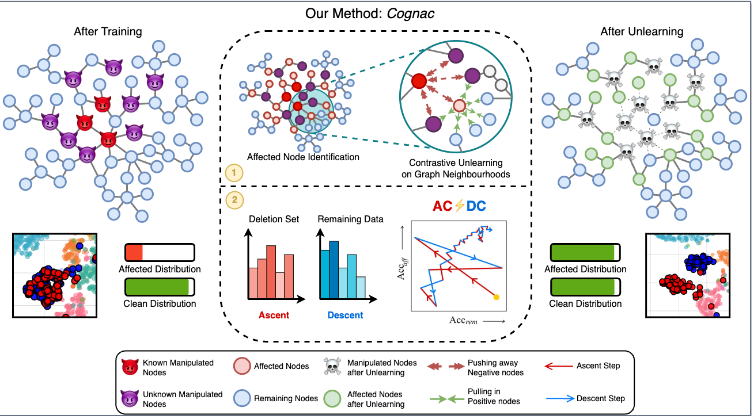

This is the code for the paper: "A Cognac shot to forget bad memories: Corrective unlearning in GNNs"




## Directory Structure

- `attacks/`: Contains attack methods that are applied on the graph.
- `framework/`: Core framework implementation and helper functions for GNN models and methods.
- `models/`: Different GNN models like GCN, GAT, etc.
- `trainers/`: Scripts for training different unlearning methods.
- `best_params.json`: Stores the best hyperparameters for model tuning.
- `classes_to_poison.json`: Contains class information for poisoning attacks.
- `hp_tune.py`: Hyperparameter tuning script.
- `logger.py`: Logging utility for training and unlearning.
- `main.py`: The main script to run training, attacks, and unlearning.
- `model_seeds.json`: Random seeds used for model reproducibility.
- `requirements.txt`: List of dependencies required to run the project.

## Installation Instructions

### Step 1: Create a Virtual Environment
It's recommended to create a virtual environment to manage dependencies. The below given steps assumes prior installation of Miniconda.

    conda create --name cognac_env python=3.10
    conda activate cognac_env

### Step 2: Install Dependencies
Once the virtual environment is activated, install the required dependencies by running:

    pip install -r requirements.txt

This will install all the necessary packages required to run the project.

## Running the Project

You can run the main script directly using the following command:

    python main.py [OPTIONS]

Example Command:

    python main.py --dataset Cora --gnn gcn --df_size 0.3 --attack_type label --unlearning_model cacdc 

## Arguments

```
usage: main.py [-h] [--train_ratio TRAIN_RATIO] [--val_ratio VAL_RATIO] [--attack_type {label,edge,random,trigger,label_strong}]
               [--unlearning_model {original,gradient_ascent,gnndelete,gnndelete_ni,gif,utu,contrastive,retrain,scrub,megu,contra_2,ssd,grub,yaum,contrascent,cacdc,scrub_no_kl_combined,scrub_no_kl}]
               [--gnn {gcn,gat,gin}] [--hidden_dim HIDDEN_DIM] [--unlearning_epochs UNLEARNING_EPOCHS] [--request {node,edge}]
               [--edge_attack_type {random,specific}] [--df_size DF_SIZE]
               [--dataset DATASET] [--random_seed RANDOM_SEED] [--trigger_size TRIGGER_SIZE] [--target_class TARGET_CLASS]
               [--train_lr TRAIN_LR] [--unlearn_lr UNLEARN_LR] [--weight_decay WEIGHT_DECAY] [--optimizer OPTIMIZER] [--training_epochs TRAINING_EPOCHS]
               [--alpha ALPHA] 
               [--topk TOPK] [--eval_on_cpu EVAL_ON_CPU] [--iteration ITERATION] [--scale SCALE]
               [--unlearn_iters UNLEARN_ITERS] [--scrubAlpha SCRUBALPHA] [--msteps MSTEPS] [--ascent_lr ASCENT_LR]
               [--descent_lr DESCENT_LR] [--contrastive_epochs_1 CONTRASTIVE_EPOCHS_1] [--contrastive_epochs_2 CONTRASTIVE_EPOCHS_2]
               [--k_hop K_HOP]
               [--contrastive_frac CONTRASTIVE_FRAC] [--steps STEPS] [--ascent_const ASCENT_CONST] [--kappa KAPPA] [--alpha1 ALPHA1] [--alpha2 ALPHA2] 
               [--linked]

options:
  -h, --help            show this help message and exit
  --train_ratio TRAIN_RATIO
                        train ratio
  --val_ratio VAL_RATIO
                        validation ratio
  --attack_type {label,edge,random,trigger,label_strong}
                        attack type
  --unlearning_model {original,gradient_ascent,gnndelete,gnndelete_ni,gif,utu,contrastive,retrain,scrub,megu,contra_2,ssd,grub,yaum,contrascent,cacdc,scrub_no_kl_combined,scrub_no_kl}
                        unlearning method
  --gnn {gcn,gat,gin}   GNN architecture
  --hidden_dim HIDDEN_DIM
                        hidden dimension
  --unlearning_epochs UNLEARNING_EPOCHS
                        number of epochs to unlearn for
  --request {node,edge}
                        unlearning request
  --edge_attack_type {random,specific}
                        edge attack type
  --df_size DF_SIZE     Forgetting Fraction
  --dataset DATASET     dataset
  --random_seed RANDOM_SEED
                        random seed
  --trigger_size TRIGGER_SIZE
                        Poison Tensor Size
  --target_class TARGET_CLASS
                        class to add trigger to
  --train_lr TRAIN_LR   initial learning rate
  --unlearn_lr UNLEARN_LR
                        unlearn learning rate
  --weight_decay WEIGHT_DECAY
                        weight decay
  --optimizer OPTIMIZER
                        optimizer to use
  --training_epochs TRAINING_EPOCHS
                        number of epochs to train
  --alpha ALPHA         alpha in loss function
  --topk TOPK           top k for evaluation
  --eval_on_cpu EVAL_ON_CPU
                        whether to evaluate on CPU
  --iteration ITERATION
  --scale SCALE
  --unlearn_iters UNLEARN_ITERS
                        number of epochs to train (default: 31)
  --scrubAlpha SCRUBALPHA
                        KL from og_model constant for SCRUB, higher incentivizes closeness to ogmodel
  --msteps MSTEPS       Maximization steps on forget set for SCRUB
  --ascent_lr ASCENT_LR
                        Learning rate for gradient ascent steps
  --descent_lr DESCENT_LR
                        Learning rate for gradient descent steps
  --contrastive_epochs_1 CONTRASTIVE_EPOCHS_1
                        epochs for contrastive unlearning
  --contrastive_epochs_2 CONTRASTIVE_EPOCHS_2
                        epochs for contrastive unlearning
  --k_hop K_HOP         number of hops for the data sampling
  --contrastive_frac CONTRASTIVE_FRAC
                        fraction of nodes to sample for contrastive loss
  --steps STEPS         steps of ascent and descent
  --ascent_const ASCENT_CONST
                        constant for ascent
  --kappa KAPPA
  --alpha1 ALPHA1
  --alpha2 ALPHA2
  --linked              whether to use linked model
  ```

For the full list of options and their descriptions, run:

    python main.py --help
